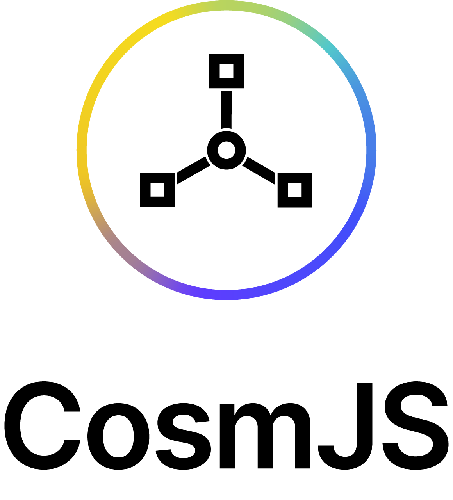

<h1><p align="center"></p></h1>

<div align="center">
  <a href="https://lgtm.com/projects/g/cosmos/cosmjs/context:javascript"></a>
  <a href="https://github.com/cosmos/cosmjs/blob/main/LICENSE">
    
  </a>
</div>

finschia-js is the Swiss Army knife to power JavaScript based client solutions
ranging from Web apps/explorers over browser extensions to server-side clients
like faucets/scrapers in the Cosmos ecosystem.

## Packages

finschia-js is a library that consists of many smaller npm packages within the
[@finschia namespace](https://www.npmjs.com/org/finschia), a so called monorepo.
Here are some of them to get an idea:

| Package                                 | Description                                 | Latest                                                                                                                  |
| --------------------------------------- | ------------------------------------------- | ----------------------------------------------------------------------------------------------------------------------- |
| [@finschia/finschia](packages/finschia) | A client library for the Finschia SDK 0.43+ | [](https://www.npmjs.com/package/@finschia/finschia) |

## Supported JS environments

Currently the codebase supports the following runtime environments:

1. Node.js 12+
2. Modern browsers (Chromium/Firefox/Safari, no Internet Explorer or
   [Edge Spartan](https://en.wikipedia.org/wiki/Microsoft_Edge#Development))
3. Browser extensions (Chromium/Firefox)

Our current JavaScript target standard is ES2018. We use WebAssembly to
implement certain cryptographic functions.

We're happy to adjust this list according to users' needs as long as you don't
ask for Internet Explorer support. If your environment does not support Wasm, we
can work on a solution with swappable implementations.

## Webpack Configs

With WebPack 5, you have to be explicit about the usage of Node.js types and
modules that were simply replaced with re-implementations for browsers in
Webpack 4.

Configs for v0.4.0-rc0 and later:

```js
module.exports = [
  {
    // ...
    plugins: [
      ...,
      new webpack.ProvidePlugin({
        Buffer: ["buffer", "Buffer"],
      }),
    ],
    // ...
    resolve: {
      fallback: {
        buffer: false,
        crypto: false,
        events: false,
        path: false,
        stream: false,
        string_decoder: false,
      },
    },
  },
];
```

Configs for finschia-js < v0.4.0-rc0

```js
module.exports = [
  {
    // ...
    plugins: [
      ...,
      new webpack.ProvidePlugin({
        Buffer: ["buffer", "Buffer"],
      }),
    ],
    // ...
    resolve: {
      fallback: {
        buffer: false,
        crypto: false,
        events: false,
        path: false,
        stream: require.resolve("stream-browserify"),
        string_decoder: false,
      },
    },
  },
];
```

## Roadmap

We use [release milestones](https://github.com/cosmos/cosmjs/milestones). For
higher level roadmap discussion please reach out to the team.

## Get in touch

The finschia-js development team is happy to get in touch with you for all
questions and suggestions.

- [GitHub issues](https://github.com/line/finschia-js/issues) for bugs and
  feature requests

## Development

See [HACKING.md](HACKING.md).
